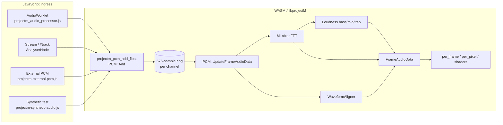

# Audio pipeline (B3HD / WASM)

How audio reaches preset equations and shaders, how to verify reactivity, and known
limitations. Companion to issue [#115](https://github.com/ford442/Project-M/issues/115)
(Preset Modernization M2).

## End-to-end flow



Each rendered frame calls `PCM::UpdateFrameAudioData()` **once** (see
`ProjectM.cpp`). That step:

1. Copies the circular input buffer → aligned waveform (480 samples exposed to presets)
2. Runs FFT → 512-bin spectrum (left/right)
3. Aligns waveforms to previous frame (calmer motion)
4. Updates bass / mid / treb beat-detection values + attenuated variants

Preset code reads these via evaluator variables (`bass`, `bass_att`, `mid`, `treb`,
`value1`/`value2` spectrum samples, waveform arrays in custom waves, etc.).

## Constants (C++)

| Symbol | Value | Role |
|--------|-------|------|
| `AudioBufferSamples` | 576 | Internal PCM ring + FFT input window |
| `WaveformSamples` | 480 | Waveform data exposed per frame |
| `SpectrumSamples` | 512 | FFT output bins |

Defined in `src/libprojectM/Audio/AudioConstants.hpp`.

Beat bands split the spectrum into sixths (`Loudness::Band` in `Loudness.hpp`):

- **bass** — bins 0–85
- **mid** — bins 86–170
- **treb** — bins 171–255

Relative values (`bass`, `mid`, `treb`) revolve around **1.0**; spikes on transients,
quieter during silence. Attenuated variants (`bass_att`, …) change more slowly.

## JavaScript ingress paths

| Path | File | Feed size | Preprocessing |
|------|------|-----------|---------------|
| **Worklet** (local decode) | `projectm_audio_processor.js` → `projectM_emscripten.cpp` | **576** mono batch | Last 576 samples before `_projectm_pcm_add_float_wrapper` |
| **Stream / `#track`** | `js_feed_stream_data_to_projectm` | **576** mono | Last 576 of AnalyserNode time-domain buffer |
| **External PCM** | `html/projectm-external-pcm.js` | **576** per channel | `preprocessExternalPcm()` trim + optional `externalPcmGain` |
| **Legacy uint8** | `add_audio_data()` | variable | Mono 8-bit centered at 128 |

All float paths should hit `projectm_pcm_add_float` with the same effective analysis
window so beat detection feels comparable across sources.

### External PCM tuning

```javascript
localStorage.externalPcmGain = "1.8";  // boost quiet FLAC/MOD analyser levels
setupExternalAudioReceiver({ debugRms: true });  // log RMS per chunk
```

See `docs/EMSCRIPTEN.md` § External Audio Sources for manual parity checks against
`#track` on `milk011.milk`.

### Synthetic / debug

| Tool | Enable | Purpose |
|------|--------|---------|
| `?audioTest=1` | `projectm-core.html` | Panel: silence / bass / mid / treble / beat / sweep |
| `?debugSender=1` | `projectm-core.html` | Local tone/mic → external PCM bridge |
| `window.feedPCMToModuleForDebug(buf, ch)` | always in core | Direct feed from console |

Generators live in `html/projectm-synthetic-audio.js`.

## WASM initialization

- `projectm_set_beat_sensitivity(pm, 1.50)` at init (`projectM_emscripten.cpp`)
- Sensitivity scales detection **after** PCM ingestion; fix amplitude/window parity first
  when comparing sources.

## Verification

### 1. Native unit tests (recommended, no GL)

```bash
cmake -DBUILD_TESTING=ON ...
cmake --build cmake-build --config Debug --target projectM-unittest
./cmake-build/tests/libprojectM/Debug/projectM-unittest --gtest_filter=PCMAudioReactivity.*
```

`tests/libprojectM/PCMAudioReactivityTest.cpp` feeds synthetic sine/silence/beat
impulses directly into `PCM` and asserts:

- Silence → near-zero waveform
- Tone → non-zero waveform + spectrum
- 80 Hz vs 6 kHz → different spectral band energy
- Beat onset → `bass` relative spike
- Mono duplicates to right channel

### 2. Reference preset (visual)

Load `presets/tests/300-beatdetect-bassmidtreb.milk`:

- Red wave → **bass**
- Green wave → **mid**
- Blue wave → **treb**

Use `?audioTest=1` and switch bass / mid / treble modes; each band's wave should
rise/fall independently.

### 3. WASM automated smoke (optional)

```bash
# After WASM smoke build
node scripts/test_audio_reactivity_wasm.mjs cmake-build/wasm-smoke/projectm-v.030-thread.js
```

`tests/wasm-smoke/audio_reactivity.html` compares canvas channel means (silence vs
80 Hz vs 5 kHz) on the beatdetect preset.

### 4. Manual reference tracks

| Signal | Expected |
|--------|----------|
| Silence | Low `bass`/`mid`/`treb`; minimal wave motion |
| Steady 80 Hz sine | Strong bass band / red wave |
| Steady 800 Hz sine | Strong mid / green wave |
| Steady 5 kHz sine | Strong treb / blue wave |
| 120 BPM kick pattern | Rhythmic `bass` spikes |
| Frequency sweep | Band response migrates bass → treb |

## Multi-source policy (`AudioSourceRouter`)

### Problem: double-feed risk

Four JavaScript paths can all call `projectm_pcm_add_float` independently.  If two are
active simultaneously the PCM ring buffer is overwritten on every frame, producing
unpredictable waveforms and beat-detection artefacts.

### Exclusive-mode policy (default)

`html/projectm-audio-router.js` implements a lightweight `AudioSourceRouter` that
tracks exactly one *active* source at a time.  Switching activates the new source and
silences the gate for the previous one.

```
AudioSourceRouter
  .activate('external')  → sets activeSource = 'external'
  .activate('element')   → sets activeSource = 'element'
  .shouldFeedExternal()  → true only when activeSource === 'external'
```

`ProjectMContext` creates one router instance per context (`context.audioSourceRouter`).
`#wireAudio` calls `router.activate()` for whichever source is configured; the external
PCM feed is wrapped in a guard that calls `router.shouldFeedExternal()` before forwarding
each chunk to the engine:

```javascript
setupExternalAudioReceiver({
    onFeed: (buffer, channels, sampleRate, samplesPerChannel) => {
        if (!router.shouldFeedExternal()) return false;   // exclusive gate
        return defaultFeedPCMToModule(buffer, channels, sampleRate, samplesPerChannel);
    },
});
```

Chunks arriving when the router is not in `'external'` mode are returned as `false` and
queued by `setupExternalAudioReceiver`; they can be flushed later if the source switches
back.

> **Note on WASM-managed paths**: the worklet and stream-analyser paths are controlled
> by C++ code inside the WASM module and cannot be suppressed from JavaScript alone.
> The router documents and tracks intent; full suppression of the worklet path would
> require a future C++ export (`_set_audio_source_enabled`).

### Source names

| Name | Description |
|------|-------------|
| `'none'` | No source configured (initial / reset state) |
| `'worklet'` | Internal AudioWorklet (`projectm_audio_processor.js`) |
| `'element'` | Media element / stream analyser (`#audio-stream-element`) |
| `'external'` | MOD/FLAC players via `postMessage` / `BroadcastChannel` |

### `pm-audio-source` event

Whenever the active source changes, the router dispatches a `CustomEvent` on `window`:

```javascript
window.addEventListener('pm-audio-source', (event) => {
    console.log('active source:', event.detail.source);
    // → 'none' | 'worklet' | 'element' | 'external'
});
```

Hosts can use this to update a status badge, mute/unmute UI controls, or log analytics
without polling `context.activeAudioSource`.

### Accessing the current source

```javascript
const context = new ProjectMContext({ canvas, audioSource: 'external', ... });
await context.start();

console.log(context.activeAudioSource);            // 'external'
console.log(context.audioSourceRouter.activeSource); // same
context.audioSourceRouter.shouldFeedExternal();    // true
```

### Switching sources at runtime

The router supports runtime switching (e.g. FLAC player popup opened while element
audio is playing):

```javascript
// Activate external PCM — element feed is now gated
context.audioSourceRouter.activate('external');

// Switch back to element; external PCM is gated again
context.audioSourceRouter.activate('element');
```

### Mix mode (not yet implemented)

Mixing multiple sources is intentionally **not** the default because double-feeding
degrades beat detection.  If you need mixing, bypass `shouldFeedExternal()` in your own
`onFeed` wrapper and document the policy in your host.  A formal mix-mode API can be
added to `AudioSourceRouter` without breaking the exclusive default.

---

## External PCM sender contract

This section documents the message shape expected by `html/projectm-external-pcm.js`
(the receiver) so that external players (`ford442/mod-player`,
`ford442/flac_player`, custom web players) can interoperate reliably.

### `postMessage` shape

```
{
  type:       'pcm',          // required, literal string
  buffer:     Float32Array,   // required — interleaved samples (see below)
  channels:   1 | 2,          // required — 1 = mono, 2 = stereo interleaved
  sampleRate: number          // optional but recommended (e.g. 44100, 48000)
}
```

Post to `window.opener` or the parent window:

```javascript
// Minimum viable sender (player page)
window.opener.postMessage(
    { type: 'pcm', buffer: float32Array, channels: 1, sampleRate: 48000 },
    '*'          // origin '*' is acceptable; receiver enforces its own allowlist
);
```

Also broadcast on `BroadcastChannel('projectm-audio')` for same-origin tabs:

```javascript
const bc = new BroadcastChannel('projectm-audio');
bc.postMessage({ type: 'pcm', buffer: float32Array, channels: 1 });
```

### Buffer layout

| `channels` | Buffer layout | `buffer.length` |
|-----------|---------------|-----------------|
| `1` (mono) | `[L0, L1, …, Ln]` | n samples |
| `2` (stereo) | `[L0, R0, L1, R1, …]` | 2n samples (interleaved) |

Stereo buffers with an **odd** total length are silently rejected.

### Analysis window

Send **≥ 576 samples per channel** per message for full beat-detection coverage.  The
receiver trims to the most recent 576 samples before feeding the engine (matching the
internal worklet and stream paths).  Sending fewer samples is allowed but reduces FFT
resolution.

```
Recommended: buffer.length ≥ 576 * channels (= 576 mono, 1152 stereo)
```

### Origin allowlist

The receiver enforces an origin allowlist.  External players must originate from an
allowed domain:

| Configuration | Default |
|---------------|---------|
| `setupExternalAudioReceiver({ allowedOrigins: [...] })` | `['https://go.1ink.us', 'https://test.1ink.us']` |
| `localStorage.externalPcmOrigins` | overrides the configured list |

Origins not in the allowlist are silently dropped.

### Gain

If the external player's AnalyserNode output is quieter than the worklet path (common
for MOD/FLAC players that expose raw analyser amplitude), boost it:

```javascript
localStorage.externalPcmGain = "1.8";   // applied after the 576-sample trim
// or: setupExternalAudioReceiver({ gain: 1.8 })
```

### Player integration pattern

```javascript
// In ford442/mod-player or ford442/flac_player page:
function sendPcmToProjectM(analyserNode, sampleRate) {
    const buf = new Float32Array(576);
    analyserNode.getFloatTimeDomainData(buf);
    window.opener?.postMessage(
        { type: 'pcm', buffer: buf, channels: 1, sampleRate },
        '*'
    );
}
// Call sendPcmToProjectM() once per render frame (requestAnimationFrame).
```

See `html/flac-player/projectm-pcm-bridge.js` for the full bridge used by the
FLAC player, including `AudioNode.connect` tap and automatic opener/parent detection.

### Queue and backpressure

The receiver maintains a pending queue (max 24 chunks).  If the WASM module is not yet
ready, chunks are queued and flushed automatically once the module initialises.  When
the queue is full the **oldest** chunk is silently dropped (LIFO eviction).  Players
need not implement flow-control: sending at ~60 fps is fine.

### E2E smoke test (deferred)

A Playwright mock-producer test that exercises the full postMessage → allowlist →
`projectm_pcm_add_float` → audio-reactivity counter pipeline is tracked in
[issue #172](https://github.com/ford442/Project-M/issues/172).  The infrastructure
for it exists in `tests/wasm-smoke/` (Playwright, synthetic PCM, audio reactivity
helper); the fixture and job wiring are deferred to a follow-up PR.

---


| Symptom | Likely cause | Mitigation |
|---------|--------------|------------|
| External player less reactive than `#track` | Analyser amplitude lower; no gain stage | `externalPcmGain` |
| Preset “dead” on Signature GPU presets | Reactivity in warp shader only; audit shows `reactivity: none` in header | Add `bass_att` to `per_frame` or warp |
| Beat values stuck at 1.0 | Silence or constant-level tone after long average | Normal; test transients |
| One frame lag | Audio fed after render | Feed PCM before `_render_frame` each tick |
| Stale ring buffer | No new PCM while rendering | Silence slowly decays; keep feeding |
| Worklet vs stream mismatch | Was 512 vs 576 batch (fixed 2026-07) | Ensure current worklet + emscripten |

## Performance notes

Hot path: `PCM::UpdateFrameAudioData()` → FFT (`MilkdropFFT.cpp`) + loudness sums.
OpenMP parallelizes loudness band sums and other audio helpers when `ENABLE_OPENMP=ON`.
SIMD builds benefit from contiguous waveform copy in `PCM::CopyNewWaveformData`.

Perf HUD (`?perf=1`) shows **Audio FFT/Loudness** timing via `audio_analysis_ms`.

## Files

| File | Role |
|------|------|
| `projectm_audio_processor.js` | Web Audio worklet; batches PCM to main thread |
| `projectM_emscripten.cpp` | Worklet/stream glue, `_projectm_pcm_add_float_wrapper` |
| `html/projectm-audio-router.js` | `AudioSourceRouter` — single-active-source policy + `pm-audio-source` events |
| `html/projectm-external-pcm.js` | MOD/FLAC postMessage bridge |
| `html/projectm-synthetic-audio.js` | Test signal generators |
| `html/projectm-context.js` | `ProjectMContext` — wires router, exposes `activeAudioSource` |
| `src/libprojectM/Audio/PCM.cpp` | Ring buffer, FFT, beat detection |
| `src/libprojectM/Audio/Loudness.cpp` | bass/mid/treb relative values |
| `tests/libprojectM/PCMAudioReactivityTest.cpp` | Automated PCM tests |
| `tests/web/audio-router.test.mjs` | Unit tests for `AudioSourceRouter` |
| `tests/web/projectm-external-pcm.test.mjs` | Unit tests for origin allowlist, queue drop, stereo/mono |

## Related docs

- [`docs/EMSCRIPTEN.md`](EMSCRIPTEN.md) — external source parity, COOP/COEP
- [`docs/PERFORMANCE.md`](PERFORMANCE.md) — OpenMP audio benchmarks
- [`docs/PRESET_METADATA.md`](PRESET_METADATA.md) — `reactivity` metadata field
