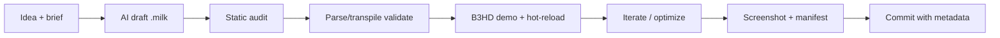

# Signature Series — Preset Creation Workflow

Repeatable pipeline for high-quality new `.milk` presets, from visual/music idea through
AI generation, B3HD demo iteration, optimization, and commit with metadata.

Companion to [`PRESET_ROADMAP.md`](PRESET_ROADMAP.md) (issue [#113](https://github.com/ford442/Project-M/issues/113))
and [`presets/agent_manifest.json`](../presets/agent_manifest.json).

## End-to-end flow



| Step | What | Command / tool |
|------|------|------------------|
| 1. **Idea** | One-paragraph visual + music mood; tie to a project lane (see below) | `grok_agent/signature_series_briefs.md` or `docs/milk0xx_creative_brief.md` template |
| 2. **Generate** | Grok / Kimi / Claude draft using pitfall checklist | `grok_agent/preset_generation_prompt.md` |
| 3. **Static audit** | Hazards, tier, GPU migration hints | `node scripts/audit_presets.mjs custom_milk_fixed/your_preset.milk` |
| 4. **Validate** | Parse + HLSL→GLSL transpile (no GPU) | `scripts/kimi_validate_preset.sh custom_milk_fixed/your_preset.milk` |
| 5. **Demo** | Live edit, audio reactivity, 60fps check | B3HD: `html/projectm-core.html?devPreset=1&localPresets=1` |
| 6. **Optimize** | Move heavy `per_pixel` → `warp_`/`comp_` `shader_body`; benchmark | [`docs/BENCHMARKING.md`](BENCHMARKING.md), `./optimize.sh --bench wasm` |
| 7. **Capture** | Reference screenshot for picker badges | `node scripts/capture_custom_milk_screenshots.mjs` (optional) |
| 8. **Manifest** | Picker + agent registry | `node scripts/generate_custom_preset_manifest.mjs` |
| 9. **Commit** | Metadata header in file + manifest/agent_manifest update | See [Metadata block](#metadata-block) |

## Project lanes (creative direction)

Tie each preset to at least one lane so the Signature Series stays coherent across demos
and sibling projects:

| Lane | Prefix | Mood | Audio focus | Example sibling project |
|------|--------|------|-------------|-------------------------|
| **Zephyr Orbital** | `orbital_rave_*` | Neon orbit, tunnel spirals, rave energy | `bass_att` → spin/warp speed | Zephyr orbital visualizer |
| **Watershed** | `cinematic_pedal_steel_*` | Warm amber, slow pans, film grain | `mid_att` → color grade | Watershed ambient sets |
| **Redwood** | `redwood_dreams_*` | Forest greens, mist, gentle drift | Low `vol` → fog density | Redwood / nature installs |
| **Candy World** | `shader_swarm_*` | Playful candy palette, particle swarms | `treb_att` → sparkle/swarm | Candy World UI skins |

Expand on the successful **`fractal_echo_*`** pattern: GPU `shader_body` for warp/composite,
minimal CPU `per_pixel` (`zoom`/`rot`/`warp` constants only), `q1..q12` bridge in `per_frame`.

## AI generation (Grok / Kimi / Claude)

1. Copy `grok_agent/preset_generation_prompt.md` into your agent session.
2. Attach a creative brief (`docs/milk011_creative_brief.md` as reference) or a row from
   `grok_agent/signature_series_briefs.md`.
3. Require output: single `.milk` file with metadata header (below).
4. Run `grok_agent/preset_review_checklist.md` before accepting the draft.

**Kimi CLI quick loop:**

```bash
# Validate after each edit
scripts/kimi_validate_preset.sh custom_milk_fixed/orbital_rave_zephyr.milk cmake-build-verify

# Upgrade pass (optional)
scripts/kimi_upgrade_preset.sh custom_milk_fixed/orbital_rave_zephyr.milk
```

## B3HD demo — hot-reload & live editing

Enable the developer panel:

```
html/projectm-core.html?devPreset=1&localPresets=1
```

Optional poll a preset file from a local static server (e.g. `python -m http.server 8765`):

```
?devPreset=1&devPresetUrl=http://127.0.0.1:8765/custom_milk_fixed/orbital_rave_zephyr.milk&devPollMs=1500
```

Features (`html/projectm-preset-dev.js`):

- **Drop / file picker** — reload on select (extends `localPresets=1`).
- **Poll URL** — auto-reload when the file changes (ETag / length).
- **Inline editor** — edit `.milk` text, `Ctrl+S` / Apply to reload.
- **Param tweaker** — sliders for `fDecay`, `zoom`, `rot`, `warp`, wave RGB; Apply patches header values.

TOML authoring (optional):

```bash
node scripts/toml_to_milk.mjs presets/drafts/orbital_rave_zephyr.toml -o custom_milk_fixed/orbital_rave_zephyr.milk
```

Then open the demo with `devPresetUrl` pointing at the output file.

## Optimization checklist (before merge)

- [ ] `per_pixel` ≤ 3 lines OR logic moved to `warp_`/`comp_` `shader_body`
- [ ] `node scripts/audit_presets.mjs` → tier `light` or `medium` (not `heavy` without warp shader)
- [ ] `scripts/kimi_validate_preset.sh` exits 0
- [ ] B3HD holds **≥ 55 fps median** on target hardware (`?benchmark=1` or `scripts/benchmark_presets_wasm.mjs`)
- [ ] No `preset_switch_failed` in console; `is_preset_ready()` within ~5s

## Metadata block

Every Signature Series preset **must** start with:

```milk
// Signature Series | orbital_rave | Zephyr Orbital
// tags: rave, orbital, bass-reactive, medium
// author: your-handle
// project: zephyr-orbital
// music: uptempo electronic / drum & bass
```

Register the file in `presets/agent_manifest.json` → `signature_series.presets` after validation.

## First batch (2026-07)

| File | Lane | Status |
|------|------|--------|
| `orbital_rave_zephyr.milk` | Zephyr Orbital | draft |
| `orbital_rave_neon.milk` | Zephyr Orbital | draft |
| `cinematic_pedal_steel_watershed.milk` | Watershed | draft |
| `cinematic_pedal_steel_horizon.milk` | Watershed | draft |
| `redwood_dreams_canopy.milk` | Redwood | draft |
| `redwood_dreams_fog.milk` | Redwood | draft |
| `shader_swarm_candy.milk` | Candy World | draft |
| `shader_swarm_reactive.milk` | Candy World | draft |

Target: **5–10** presets in the first batch; expand with `orbital_rave_*` / `shader_swarm_*` variants once the workflow is stable.

## Related docs

- [`kimi_preset_authoring_plan.md`](kimi_preset_authoring_plan.md) — Kimi runbook, pitfall list
- [`WRITING_NEW_MILK_PRESETS_GUIDE.md`](WRITING_NEW_MILK_PRESETS_GUIDE.md) — Milkdrop equation reference
- [`PERFORMANCE.md`](PERFORMANCE.md) — Profiling and 60fps governor
- [`grok_agent/preset_review_checklist.md`](../grok_agent/preset_review_checklist.md) — Agent review gate
