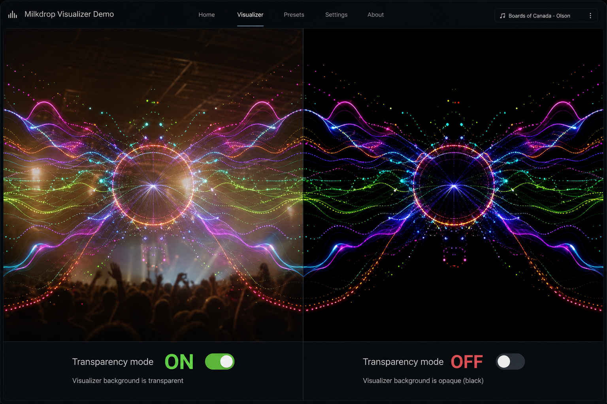

# Transparency Mode (Glass Layer)

## Goal

Enable projectM as a **glass layer** over video, album art, or a live camera feed. Near-black pixels in the final output are written with `alpha = 0`, so content behind the WebGL canvas shows through.

## Status

Implemented. Try it on [`html/projectm-core.html`](../html/projectm-core.html):

- Click **Glass Layer** (bottom-left) or open with `?transparent=1`
- Optional background media: `?bgVideo=<url>` or `?bgImage=<url>`
- Default background is a CSS gradient when no media URL is supplied


## Render paths

Final transparency is applied in the **last blit to the screen** (or legacy fallback), not in preset-internal FBOs.

| Path | When | Shader |
|------|------|--------|
| **CopyTexture** | Desktop / legacy WASM fallback (`projectm_opengl_render_frame`) | `copy_texture` fragment shader |
| **PresetTransition** | Native soft-cut transitions | `TransitionShaderMainGlsl330.frag` |
| **CompositingBlendShader** | WASM dual-FBO pipeline (normal + transition frames) | Inline shader in `projectM_emscripten.cpp` |

### Dual-FBO transitions (WASM)

Steady-state browser frames render directly to the canvas (no dual-FBO compositor blit). The dual-FBO path is only enabled while a soft-cut transition is active; during that window, presets render into ping-pong FBOs and `CompositingBlendShader` blends to the canvas.

Preset internals stay opaque in both paths; transparency runs only on the final canvas-facing pass (`CopyTexture` for steady-state / fallback, `CompositingBlendShader` during transitions). This avoids flashing opaque black during transitions while keeping non-transition frames on the cheaper direct path.

### Design Notes

- **Threshold**: `0.01` handles floating-point noise and dithering while treating true black as transparent. Tune at runtime via `projectm_set_transparency_threshold()` / `set_transparency_threshold()` (WASM).
- **Premultiplied Alpha**: The WebGL context already uses `premultipliedAlpha = EM_TRUE`. For black pixels, RGB is near-zero, so premultiplication does not alter the color.
- **Why not `discard`**: Using `discard` in fragment shaders can hurt performance on tile-based GPUs and may leave previous-frame pixels visible if the drawing buffer is not cleared. Explicitly writing `vec4(0,0,0,0)` is safer.
- **No extra FBO**: This approach avoids an intermediate framebuffer and extra render pass, keeping the change minimal and performant.

### Dual-FBO transitions

Preset rendering still uses the existing dual ping-pong FBO pair inside each `MilkdropPreset`. Transparency is applied only on the **final** blit to the default framebuffer:

1. **Normal frames** — `CopyTexture::Draw()` writes near-black pixels with `alpha = 0` when transparency mode is on.
2. **Soft transitions** — `PresetTransition` applies the same rule in `TransitionShaderMainGlsl330.frag`. For **multi-pass** transition shaders, pass 0 (intermediate FBO) keeps opaque alpha so pass 1 can sample a full RGB buffer; transparency is enabled only on the final pass draw.
3. **Internal copies** — `CopyTexture` burn-in / flip paths leave `u_transparencyEnabled = 0` so preset textures are not corrupted.

The WASM dual-FBO transition API (`dual_fbo_*`) is unchanged; hosts that composite externally should enable transparency mode on the engine before the final `render_frame` / default-FBO present.

### Demo (`html/projectm-core.html`)

- Background image `#bg-media` sits at `z-index: 2999` (between `#scanvas` and `#mcanvas`).
- Panel button **Glass transparency** toggles engine transparency mode and hides the black `#scanvas` underlay.
- URL: `?transparent=1` enables on load (persisted in `localStorage` as `projectm:transparencyMode`).



## API

### C++

- `ProjectM::SetTransparencyMode(bool)` / `TransparencyMode()`
- `ProjectM::SetTransparencyThreshold(float)` / `TransparencyThreshold()` — default `0.01`

### C

```c
void projectm_set_transparency_mode(projectm_handle instance, bool enabled);
bool projectm_get_transparency_mode(projectm_handle instance);
void projectm_set_transparency_threshold(projectm_handle instance, float threshold);
float projectm_get_transparency_threshold(projectm_handle instance);
```

### WASM / JavaScript

```js
Module._set_transparency_mode(1);
Module._set_transparency_threshold(0.01);
```

See [WASM_JS_API.md](WASM_JS_API.md) for generated helpers.

## WebGL context requirements

Documented in [EMSCRIPTEN.md](EMSCRIPTEN.md#webgl-context-attributes):

- `alpha: true`
- `premultipliedAlpha: true`

For near-black pixels, premultiplied RGB ≈ 0, so compositing matches straight-alpha expectations.

## Shader rule

```glsl
if (u_transparencyEnabled > 0) {
    float maxComponent = max(max(color.r, color.g), color.b);
    if (maxComponent < u_transparencyThreshold) {
        color = vec4(0.0, 0.0, 0.0, 0.0);
    }
}
```

- **Threshold** default `0.01` — tolerates dither/noise without punching holes in dark but visible preset content.
- **No `discard`** — explicit `vec4(0)` avoids tile-GPU pitfalls and stale pixels when the drawing buffer is not cleared.

## Host page layering (`projectm-core.html`)

| Element | z-index | Role |
|---------|---------|------|
| `#bg-media` | 2999 | Background image behind the visualizer |
| `#scanvas` | 3000 | Opaque black underlay (hidden in glass mode) |
| `#mcanvas` | 3001 | WebGL visualizer |

## Design notes

- No extra framebuffer — transparency is a uniform branch in existing final-output shaders.
- Tunable threshold does not affect normal mode (`u_transparencyEnabled == 0`).
- User sprites draw after the final blit; they are not auto-masked by this mode.
